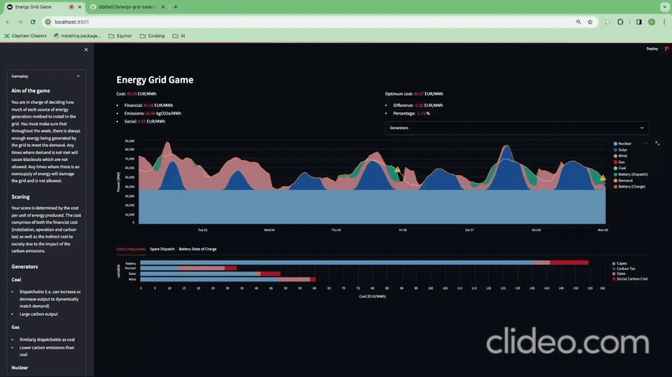

# Energy Grid Balancing Game
Game to balance energy generators in the electricity grid

[Click here to play](https://energy-grid-balancing-game.streamlit.app/)

## Purpose
To create an engaging way to educate people about the challenges of balancing the energy grid at out reach programmes and events.

## Gameplay
The user is able to select energy generators from a range of sources (both renewables and hydrocarbon based) and is tasked to select a balance that reduce cost and emissions whilst ensuring that demand is always met.

## Setup and launch game
1. Clone this repository
1. Open repository in Python tool of choice
1. Create virtual environment
1. Run the following commands:
    - `pip install -U pip`
    - `pip install poetry`
    - `poetry install`
    - `streamlit run app.py`

## To do
- Add battery storage entity
    - Display surplus energy
- More graphs
    - Distribution of dispatched/spare/installed energy
    - Distribution of dispatched energy per source
    - Tab separated graphs
- Update screencast gif to README
- Share on Slack